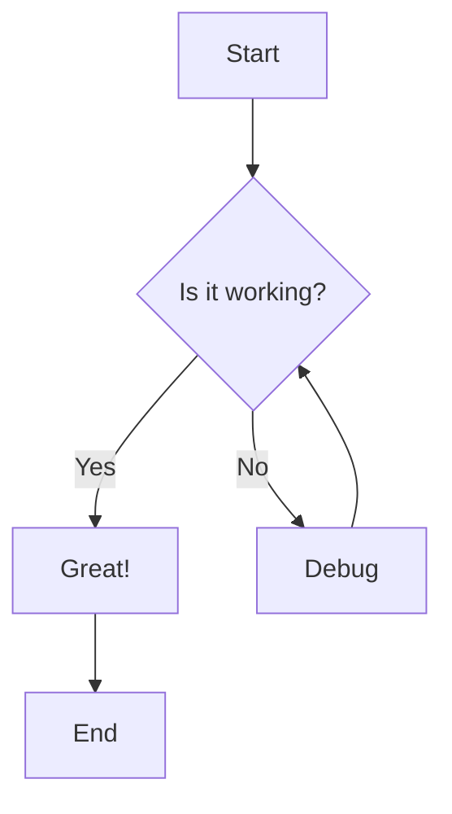
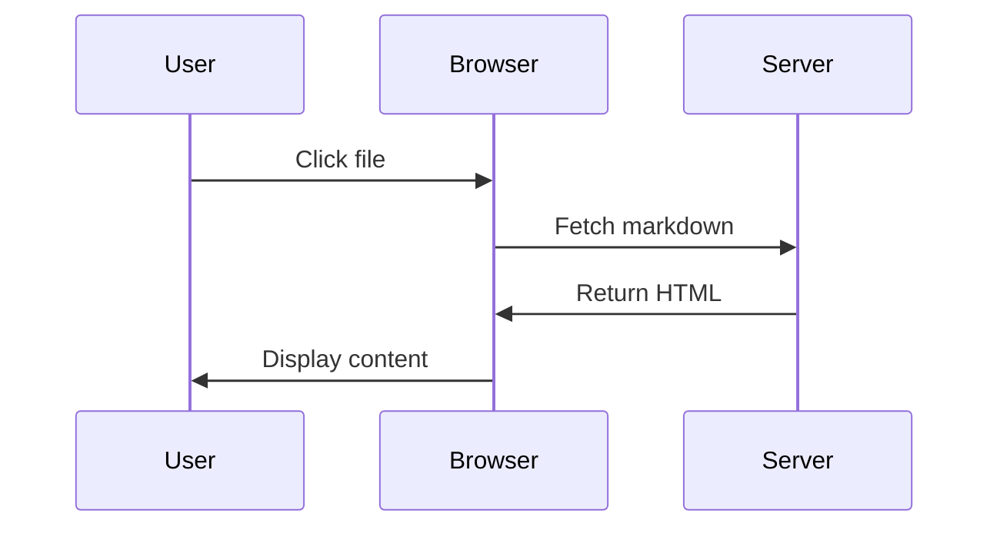
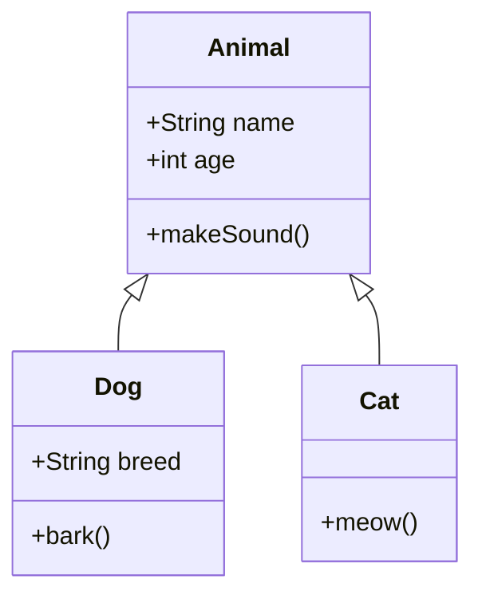

# Markdown Preview Test

This file tests various markdown rendering features.

## Headings

### Subheading
#### Sub-subheading

## Text Formatting

This is **bold text** and this is *italic text*.

Here's some `inline code` and a [link to Google](https://google.com).

## Lists

### Unordered List
- Item 1
- Item 2
  - Nested item 2.1
  - Nested item 2.2
- Item 3

### Ordered List
1. First item
2. Second item
3. Third item

## Code Block Examples

### JavaScript

```javascript
// Function to greet users
function greetUser(name, age) {
  const greeting = "Hello, " + name + "!";
  const yearBorn = 2025 - age;
  
  if (age >= 18) {
    console.log(greeting + " You were born in " + yearBorn);
    return true;
  } else {
    console.log("Welcome, young one!");
    return false;
  }
}

// Class example
class Animal {
  constructor(name, type) {
    this.name = name;
    this.type = type;
  }
  
  speak() {
    return `${this.name} makes a sound`;
  }
}

const dog = new Animal("Buddy", "dog");
greetUser("Alice", 25);
```

### TypeScript

```typescript
interface User {
  id: number;
  name: string;
  email: string;
  isActive: boolean;
}

type UserRole = "admin" | "user" | "guest";

async function fetchUser(userId: number): Promise<User> {
  const response = await fetch(`/api/users/${userId}`);
  const data: User = await response.json();
  return data;
}

// Generic function example
function createArray<T>(length: number, value: T): T[] {
  return Array(length).fill(value);
}

const numbers = createArray<number>(5, 42);
```

### Python

```python
# Import statements
import os
from typing import List, Dict, Optional

# Class definition
class TaskManager:
    """A simple task manager class"""
    
    def __init__(self, name: str):
        self.name = name
        self.tasks: List[Dict] = []
    
    def add_task(self, title: str, priority: int = 1) -> None:
        task = {
            "title": title,
            "priority": priority,
            "completed": False
        }
        self.tasks.append(task)
        print(f"Added task: {title}")
    
    def complete_task(self, index: int) -> bool:
        if 0 <= index < len(self.tasks):
            self.tasks[index]["completed"] = True
            return True
        return False

# Usage
manager = TaskManager("My Tasks")
manager.add_task("Review code", 2)
manager.complete_task(0)
```

### YAML Configuration

```yaml
# Application Configuration
app:
  name: "Markdown Preview"
  version: 1.0.0
  port: 5000
  
server:
  host: "0.0.0.0"
  timeout: 30
  
features:
  - markdown-rendering
  - mermaid-diagrams
  - syntax-highlighting
  
database:
  type: postgresql
  host: localhost
  credentials:
    user: admin
    password: "secure_password_123"
```

### Bash/Shell

```bash
#!/bin/bash

# Deploy script example
ENVIRONMENT="production"
APP_NAME="markdown-preview"

function deploy_app() {
  local env=$1
  echo "Deploying ${APP_NAME} to ${env}..."
  
  # Build application
  npm run build
  
  # Run tests
  if npm test; then
    echo "Tests passed! Continuing deployment..."
  else
    echo "Tests failed! Aborting deployment."
    exit 1
  fi
  
  # Deploy
  rsync -avz ./build/ server:/var/www/${APP_NAME}/
  echo "Deployment complete!"
}

deploy_app "$ENVIRONMENT"
```

### CSS

```css
/* Replit-inspired theme */
.markdown-preview {
  font-family: 'Inter', sans-serif;
  line-height: 1.6;
  color: #1f2937;
}

.code-block {
  background-color: #f3f4f6;
  border: 1px solid #e5e7eb;
  border-radius: 0.375rem;
  padding: 1rem;
}

.syntax-highlighted {
  font-family: 'Fira Code', monospace;
}

/* Keywords in blue */
.keyword {
  color: #2563eb;
  font-weight: 500;
}

/* Strings in orange */
.string {
  color: #c2410c;
}

@media (max-width: 768px) {
  .markdown-preview {
    font-size: 0.875rem;
  }
}
```

### HTML

```html
<!DOCTYPE html>
<html lang="en">
<head>
  <meta charset="UTF-8">
  <meta name="viewport" content="width=device-width, initial-scale=1.0">
  <title>Markdown Preview</title>
  <link rel="stylesheet" href="styles.css">
</head>
<body>
  <div class="container">
    <header>
      <h1>Welcome to Markdown Preview</h1>
      <nav>
        <a href="/" class="active">Home</a>
        <a href="/docs">Documentation</a>
      </nav>
    </header>
    
    <main id="content">
      <article class="markdown-body">
        <!-- Markdown content renders here -->
      </article>
    </main>
  </div>
  
  <script src="app.js"></script>
</body>
</html>
```

### SQL

```sql
-- Create users table
CREATE TABLE users (
  id SERIAL PRIMARY KEY,
  username VARCHAR(50) UNIQUE NOT NULL,
  email VARCHAR(100) UNIQUE NOT NULL,
  created_at TIMESTAMP DEFAULT CURRENT_TIMESTAMP
);

-- Insert sample data
INSERT INTO users (username, email) VALUES
  ('alice', 'alice@example.com'),
  ('bob', 'bob@example.com'),
  ('charlie', 'charlie@example.com');

-- Query with joins
SELECT 
  u.username,
  u.email,
  COUNT(p.id) as post_count
FROM users u
LEFT JOIN posts p ON u.id = p.user_id
WHERE u.created_at > '2024-01-01'
GROUP BY u.id, u.username, u.email
HAVING COUNT(p.id) > 5
ORDER BY post_count DESC
LIMIT 10;
```

### JSON

```json
{
  "name": "markdown-preview-app",
  "version": "1.0.0",
  "description": "A Next.js markdown preview application",
  "scripts": {
    "dev": "next dev -p 5000",
    "build": "next build",
    "start": "next start",
    "test": "jest"
  },
  "dependencies": {
    "next": "^16.0.0",
    "react": "^19.0.0",
    "highlight.js": "^11.9.0",
    "mermaid": "^10.6.0"
  },
  "devDependencies": {
    "typescript": "^5.0.0",
    "tailwindcss": "^3.4.0"
  }
}
```

## Blockquote

> This is a blockquote
> It can span multiple lines

## Mermaid Diagrams

### Flowchart Example



### Sequence Diagram



### Class Diagram



## Table

| Feature | Status |
|---------|--------|
| Markdown | ✅ |
| Mermaid | ✅ |
| Styling | ✅ |

## Conclusion

This test file demonstrates that the markdown preview supports all standard markdown features plus Mermaid diagrams!
